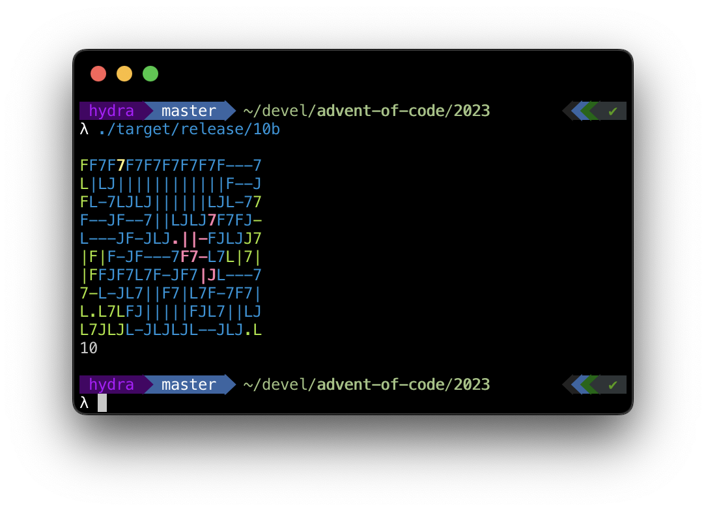

# Solution notes

## Day 1

I got trapped by both parts. In the first part, I ended up with an awful regex like `/\D*(\d).*?(\d?)\D*$/`. In the second part, that regex led me astray; I preprocessed each line by replacing each word from left to right. The problem was sneakily-worded to make that seem viable.

## Day 2

Stumbled on min vs max for part 2, but otherwise went smoothly!

## Day 3

Part 1 was a nightmare. I kept getting the example correct, but failing on the real input. Tried a lot of things: using negative numbers, treating digits as symbols, etc. I even rewrote my solution into a different language to try to figure it out. Turns out I had two different off-by-one errors (one carried over into my Perl). Part 2 was quick and painless.

# Day 4

Part 1 was quick and easy. Part 2 I ended up with an exponential solution (maintain a queue of card IDs to process; I could have at least cached the score of each card…). I had a working solution at 00:07:31 (which would have put me somewhere between rank 101-200), but it took too long to run so I assumed I hit an infinite loop. I faffed around for a bit, ran a release build (which still took 5 seconds), and got the star at 14 mins. (I'm much happier with the much better time complexity of my tidied solution.)

# Day 5

Part 1 was fine. A little overcomplicated perhaps. If needed I could have trivally extended my solution to handle multiple branching paths. Unfortunately that was not the direction part 2 went.

Part 2 was brutal. Learning from my lesson yesterday, I left the naive solution running in the background for a while, but they wouldn't let me get away with that this time (though later I tested out brute-forcing with my non-pessimized solution and it was feasible). It took me about three minutes to restructure the code to support ranges, but then I spent nearly all the two hours writing and debugging the range intersection code. I was able to simplify the problem by handling only one segment of the range (the beginning) at a time, but that still left [8 branches to debug](https://github.com/sartak/advent-of-code/blob/a4b897d15158602ed9c8045f603752b4d44d4eb7/2023/src/bin/05b.rs#L74-L111). So many off-by-one errors. I eventually cracked it by using a very small input range (`81..2`) and carefully verifying how each step transformed it. The problem branch was the last one (which assigns `nl`). [Rewriting](https://github.com/sartak/advent-of-code/commit/21094225bd678fcffe0c29d62e00b56402939d20) to use [rangemap](https://docs.rs/rangemap/1.4.0/rangemap/map/struct.RangeMap.html) was very cathartic.

Unlike day 3, I never really felt frustrated. The problem was wrapping my head around the range logic, rather than having some unknown bug somewhere with no great debugging tools. So, even though it took me far longer to solve, I greatly preferred today over day 3.

# Day 6

A nice breath of fresh air. I would have submitted part 1 at about 6 mins in,
but the puzzle input refused to load. For part 2 I just manually edited the input file rather than change the code.

# Day 7

I solved part 1 with regex, though I missed an edge case where a full-house
could be 22333 _or_ 22233. I also sorted the hands backwards which produced a
result of 6640 rather than 6440, which I'd misread as correct.

In Part 2, I tried to account for jokers directly in the regex, but it was awful. So I dropped that, though the next day I realized I could have kept the regex by first finding the most common card _n_ then string-replaced each `J` with _n_. I switched to a low-tech approach: count cards, take out the jacks, then look at the two most frequent ranks. I hit a snag though where in my editor I used "undo" too many times, which reverted my change that pushed `J` to the back of the rank order. The example (intentionally) didn't flag that error.

I feel like I could have taken half the time on both parts, but I'm not too fussed. Happy that Rust sorts (even nested) tuples correctly.

# Day 8

Part 1 went quickly and smoothly. I was particularly happy to recall the iterator [cycle](https://doc.rust-lang.org/std/iter/trait.Iterator.html#method.cycle) method.

For part 2, I let the brute force version run in the background while I looked for a better solution. My first approach was to precalculate the distance from each origin to each other node it can reach. Then iterate steps 1..infinity checking if any path length divides cleanly for all origins. Then while implementing that, I realized I'm reinventing least-common-multiple, poorly. I started down the path of finding the LCM of each distinct (origin, destination) path. But then when I debug-printed out the intermediate, results I saw that each origin reached only one destination, which is a vast simplification. I plugged the 6 path lengths into Wolfram Alpha with LCM to get the answer. After submitting I implemented the simplified version of the problem.

Insert rant here about how I'm feeling punished for solving the general problem statement rather than the specific input set they gave.

# Day 9

Can't complain too much. It went a little slower than I would have liked, mostly due to the sleep deprivation caused by the past week of midnight programming puzzles.

# Day 10

Part 1 wasn't too bad; was nice to write a breadth-first search. It's my first time this year reaching for an intermediate representation (an `Option<Pipe>` enum with values `NE`, `SE`, `Start`, etc). Which was probably worth it only in as much as it made part 2 less messy. Getting through part 1 just took a bunch of work.

In Part 2, it felt like smooth sailing. Add another loop at the end that starts at each unvisited `.`, floodfill, then mark the whole set as enclosed or not (depending on whether a map edge was touched). I'm glad I realized from the drop that I didn't have to do anything more sophisticated. I had most of the examples solved about 20 minutes into part 2. So I optimistically submitted my answer, and of course it was wrong.

Then I saw the squeeze requirement. What a doozy. This took me nearly an hour to implement on its own. I started by cleaning up my solution (e.g. updating the starting cell's pipe type rather than lazily figuring it out, switching from an `Option<Pipe>` representation to just a `Pipe` with `Dot` and `Gap` arms, etc). Then I doubled the size of the map, reconnecting pipes where needed. (I briefly considered doubling the size of the map using vim but I still would have needed to reconnect the pipes, and it wouldn't generalize to the other examples)

I left some todos in both parts where my input didn't require enumerating, say, every single possible starting pipe. But today was another first: building a debug view:

# Day 11

Not too bad on either part. While reading through I was very concerned I'd have to reify an actual graph and run Dijkstra's on it, but no, summing all pairs paths was just `abs(y1 - y0) + abs(x1 - x0)`. I also was happy that storing coordinates in a HashMap was the way to go (with the value being star index to dedupe paths). I was slightly punished for actually reshaping the map in part 1, but sometimes that's just the hand you're dealt. Luckily part 2 was amenable to iterating over all each row and column.

# Day 12

Part 1 started off smoothly enough. I constructed a regex using the lengths, so for example `1,3,2` would get transformed into `/^\.*#\.+###\.+##\.*$/`. I iterated over all possible diagrams (filling in `.` or `#` for each `?`), counting the regex matches.

That certainly did not scale to part 2. It was immediately obvious that iterating over all possible diagrams would take forever. The only thing that came to mind was a recursive solution that was aggressive about cutting the solution space. But there are an awful lot of cases to handle just right. I chunked the inputs by splitting on `.`, then used `dedup_with_count` to get a list of `(count, is_known)` pairs, which was a little easier to work with. The necessary fiddling was reminiscent of the range splitting I did in day 5. Luckily this time I had an oracle to guide me: my solution to part 1. Quite a few times I ran the input through both solutions, diffed their outputs, then picked one of the differences to debug. Then once both answers were consistent, I multiplied the inputs by 5 as part 2 asked, compiled in release build, and... the answers came back slowly. But I suspected this was going to happen, so I'd written my recursive function to be memoizable. With that, my answer popped out in significantly under a second. Adding parallelism was a one line change (`.into_iter()` -> `.into_par_iter()`) and sped up my solution by 3-4x.

# Day 13

Solving part 1 took longer than it should have. In particular figuring out the formula for what the reflected coordinate would be. But I solved it without too much fuss. Just, slowly.

Was really hoping for an easy day. While reading the problem I was concerned that part 2 would be a beast, but no, it was very straightforward. I just kept a `smudge` flag, set it on the first error (and bailed on the second error), and made sure it was true at the end of the loop. So I was happy to submit that in under two minutes.

# Day 14

This was the smoothest any problem has gone so far (as evidenced by my current best rank). In part 1 I didn't feel like figuring out a smart way to know when rocks were done rolling, so I just did one iteration of moving all boulders up by one, then stopping the outer loop when nothing changed. I figured it'd burn me in part 2 but it didn't.

For part 2 I did the dumbest possible thing for rolling in each direction: copy-paste the code four times, and adjust the deltas. I made up for that with a quick insight into how to avoid doing a billion iterations though. I realized that the pattern must repeat pretty quickly (and indeed it does: in my input, after the 150th cycle, it reverts back to cycle 108). I found that by hashing the map after each cycle (well, specifically just the position of each `O` to cut down on calculation time). Then, once we've found the repeat, we can advance the cycle counter quickly without having to simulate the rolling. I'm sure smarter folks than I just used modular arithmetic here, but I didn't want to have to fret about off-by-one errors. So instead I just enter a hot loop where I add `150-108` to the cycle count until I'm about to hit the 1 billion mark. Then I resume the normal simulations. This whole rube goldberg device runs in about 400ms; Rust my beloved.

# Results

| Day | #1 Time  | #1 Rank | #2 Time  | #2 Rank |
| --- | -------- | ------- | -------- | ------- |
| 1   | 00:09:49 | 4833    | 00:41:45 | 4721    |
| 2   | 00:04:49 | 156     | 00:09:14 | 392     |
| 3   | 01:15:13 | 8424    | 01:20:21 | 5998    |
| 4   | 00:03:43 | 268     | 00:14:04 | 979     |
| 5   | 00:22:20 | 1703    | 02:21:06 | 5161    |
| 6   | 00:08:24 | 1896    | 00:08:49 | 807     |
| 7   | 00:24:38 | 1544    | 00:38:23 | 1573    |
| 8   | 00:04:53 | 365     | 00:32:41 | 1974    |
| 9   | 00:09:13 | 1067    | 00:15:16 | 1539    |
| 10  | 00:36:36 | 1966    | 01:56:16 | 2403    |
| 11  | 00:15:16 | 1239    | 00:21:22 | 1111    |
| 12  | 00:14:46 | 436     | 03:16:53 | 3384    |
| 13  | 00:30:13 | 2175    | 00:31:36 | 1074    |
| 14  | 00:09:03 | 943     | 00:22:12 | 241     |
